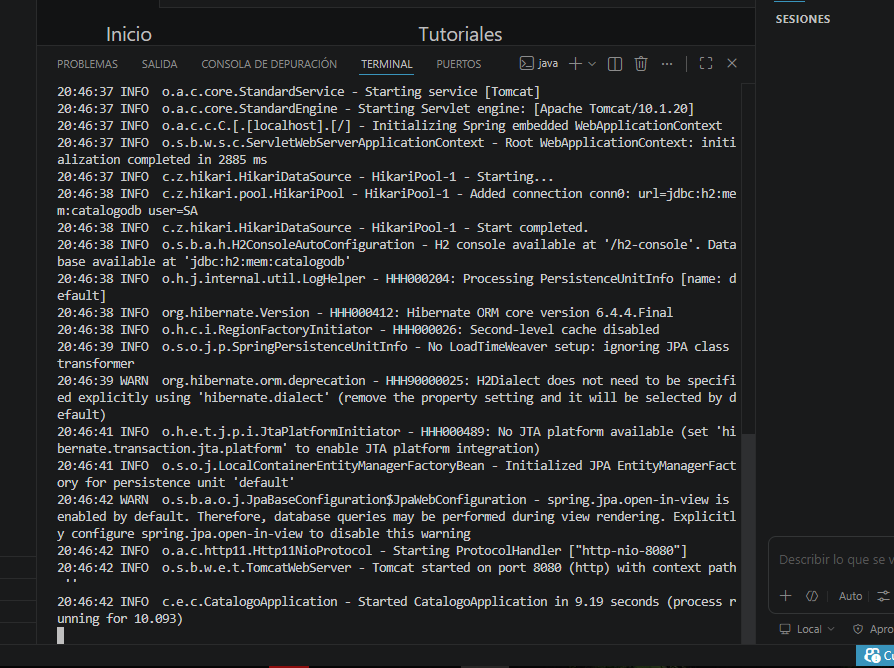

# calderon-post2-u11

Integración de **SLF4J + Logback** (logging con rotación diaria) y documentación
de API REST con **Swagger UI / springdoc-openapi** sobre la aplicación de
catálogo de productos.

**Post-Contenido 2 – Unidad 11: Buenas Prácticas y Patrones de Diseño**
Programación Web – Ingeniería de Sistemas 2026

---

## Requisitos

- Java 21
- Maven 3.9.x

---

## Ejecución

```bash
# Compilar
mvn clean compile

# Levantar la aplicación
mvn spring-boot:run
```

---

## URLs importantes

| Recurso | URL |
|---------|-----|
| API REST | http://localhost:8080/api/productos |
| Swagger UI | http://localhost:8080/swagger-ui.html |
| OpenAPI JSON | http://localhost:8080/api-docs |
| H2 Console | http://localhost:8080/h2-console |

---

## Archivos de log

Los logs se guardan en la carpeta `logs/` (excluida del repositorio por `.gitignore`):

```
logs/
└── catalogo.log          ← log del día actual
└── catalogo.2026-05-11.log  ← log histórico por fecha
```

Para ver el log en tiempo real:
```bash
# Windows PowerShell
Get-Content logs/catalogo.log -Wait

# Git Bash / Linux
tail -f logs/catalogo.log
```

---

## Endpoints REST

| Método | Endpoint               | Descripción              | Status |
|--------|------------------------|--------------------------|--------|
| GET    | /api/productos         | Listar productos activos | 200    |
| GET    | /api/productos/{id}    | Buscar por ID            | 200    |
| POST   | /api/productos         | Crear producto           | 201    |
| DELETE | /api/productos/{id}    | Eliminar producto        | 204    |

---

## Checkpoint 1 — SLF4J en consola

Ejecutar la app y en otra terminal:

```bash
curl -X POST http://localhost:8080/api/productos \
  -H "Content-Type: application/json" \
  -d "{"nombre":"Laptop","precio":3500000,"categoria":"ELECTRONICA"}"
```

En consola debe aparecer:
```
[INFO]  ProductoServiceImpl - Creando producto: nombre=Laptop, categoria=ELECTRONICA
[INFO]  ProductoServiceImpl - Producto creado exitosamente con id=1
```

---

## Checkpoint 2 — Archivo de log

Después de realizar operaciones:
```bash
cat logs/catalogo.log
```

Debe mostrar líneas con formato:
```
2026-05-11 18:20:00 INFO  com.empresa.catalogo.service.ProductoServiceImpl - Creando producto: nombre=Laptop, categoria=ELECTRONICA
2026-05-11 18:20:00 INFO  com.empresa.catalogo.service.ProductoServiceImpl - Producto creado exitosamente con id=1
```

---

## Checkpoint 3 — Swagger UI

Abrir en el navegador: **http://localhost:8080/swagger-ui.html**

Debe mostrar el grupo **"Productos"** con los 4 endpoints documentados,
incluyendo las respuestas 200/201, 400 y 404 por endpoint.

---

## Niveles de log usados

| Nivel | Cuándo se usa |
|-------|--------------|
| `INFO` | Operaciones exitosas (crear, listar, eliminar) |
| `WARN` | Recurso no encontrado, errores de validación |
| `ERROR` | Excepciones inesperadas capturadas por el handler |
| `DEBUG` | Búsquedas intermedias (solo visible en paquete `com.empresa.catalogo`) |

captures 


